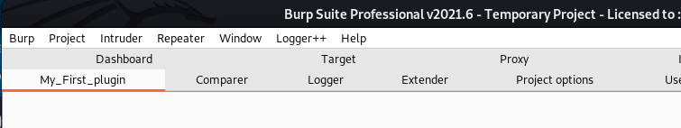

# My_First_Burp_Plugin_With_Jython
This repo should be my studies drafts documenting every step that i made in order to build a plugin with Jython

# Plugins steps:
## 1. [Only Tab name and description](https://github.com/zeroc00I/My_First_Burp_Plugin_With_Jython/blob/main/tab_name_and_description.py)

